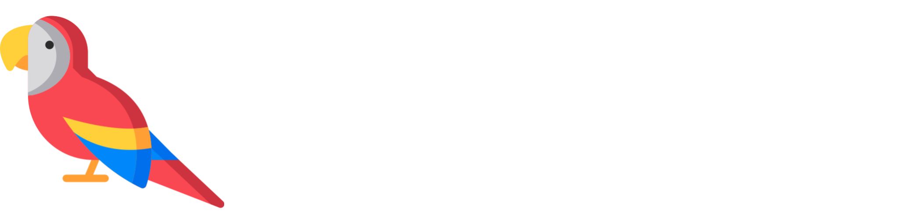

# LinguaLearn

LinguaLearn is an LLM (Gemini) based chatbot that helps users practice their speaking and comprehension skills in English, Spanish, French, and German. Using webkit's speech recognition and text-to-speech, LinguaLearn allows learners to have full conversations in their target language.

[Watch the Demo Here](https://www.youtube.com/watch?v=7RfsfbdW0Eo)

## Usage

Create a file called googleapikey.txt and place your gemini api token inside. then, run the app with `flask run`
